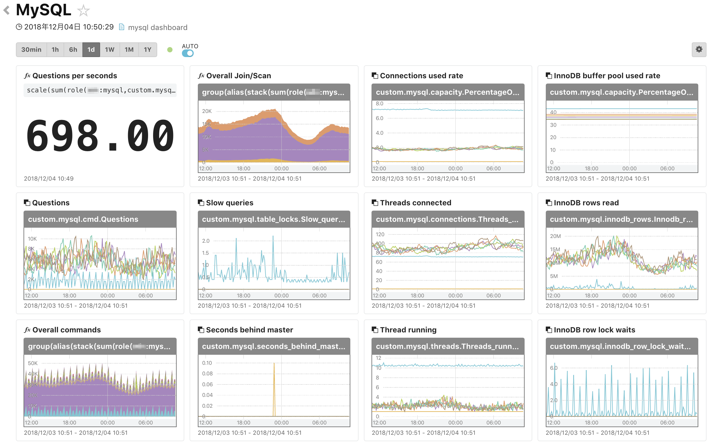
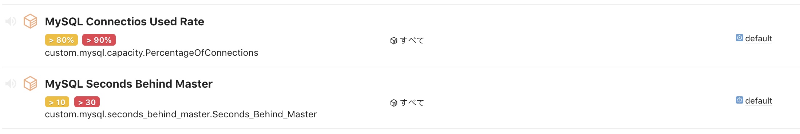

# MySQL

MySQL dashboard & monitors template for mackerel.

## Required

```bash
mackerel-plugin-mysql
```

## Dashboard

Update variable `<service>:<role>` for dashboard.json.  
ex. `mysql:mysql`

### Creating Dashboard

```bash
$ curl -X POST -H "Content-Type:application/json"  -H "X-Api-Key:<Api-Key>" https://api.mackerelio.com/api/v0/dashboards -d @dashboard.json
```

### Screenshot



## Monitors

The monitors use mkr command.

### SetUp

To use mkr, first we will assign the API key to the environment variable.

```bash
$ export MACKEREL_APIKEY=<API-Key>
```

### Register monitor configurations

```bash
$ mkr monitors push -F monitors.json
```

### Screenshot


