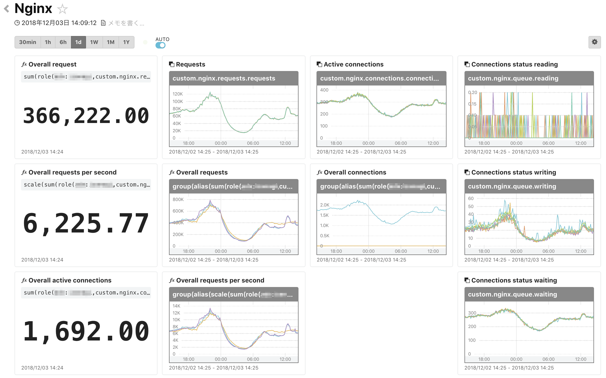

# Nginx

Nginx dashboard for mackerel.

## Required

```bash
mackerel-plugin-nginx
```

## Dashboard

update variable `<service>:<role>`  
ex. `nginx:nginx`

### Creating Dashboard

```bash
$ curl -X POST -H "Content-Type:application/json"  -H "X-Api-Key:<Api-Key>" https://api.mackerelio.com/api/v0/dashboards -d @dashboard.json
```

### Screenshot


